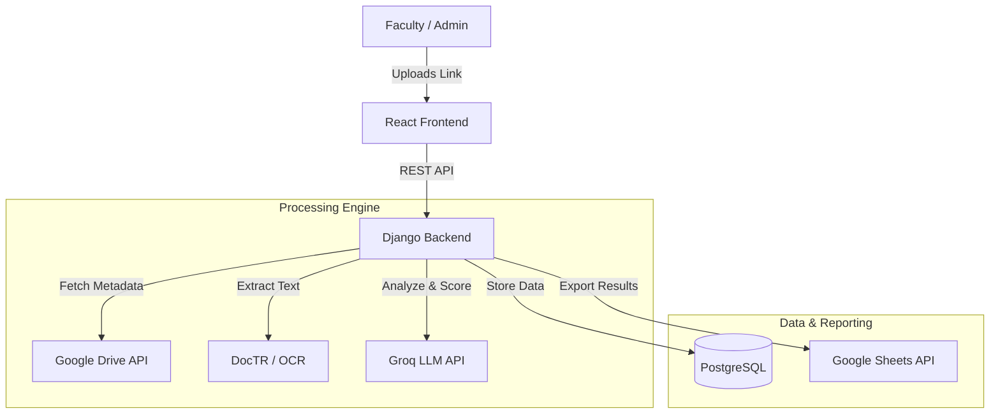

<div align="center">

# 🎓 DocEval Kapiyu
### Intelligent Faculty Evaluation & Promotion System (NBC 461)

[](https://reactjs.org/)
[](https://www.djangoproject.com/)
[](https://www.python.org/)
[](https://groq.com/)
[](https://developers.google.com/drive)

<p align="center">
  <b>Automating Academic Advancement with AI-Powered Document Analysis</b><br>
  <i>Streamlining the NBC 461 evaluation process for State Universities and Colleges.</i>
</p>

</div>

---

## 📖 Overview

**DocEval Kapiyu** is a cutting-edge web application engineered to modernize the faculty evaluation and promotion lifecycle. By integrating **Large Language Models (LLMs)** via Groq and **Optical Character Recognition (OCR)**, the system automates the extraction, classification, and scoring of faculty credentials according to the **National Budget Circular (NBC) No. 461** standards.

It transforms a tedious manual process into a seamless, data-driven experience, providing real-time analytics on faculty ranking and gap analysis.

---

## 🏗️ System Architecture



---

## ✨ Key Features

| Feature | Description |
| :--- | :--- |
| **🤖 AI-Powered Extraction** | Automatically extracts semantic data from documents (e.g., Academic Year, Degree, Role) using **Groq LLM**. |
| **👀 Smart "Peek" Preview** | Instantly validates Google Drive links and previews folder/file names before submission to prevent errors. |
| **📊 Automated Scoring** | Calculates **CCE (Common Criteria for Evaluation)** points automatically based on strict NBC 461 rules (e.g., BSIT = Special Project). |
| **☁️ Cloud Integration** | Seamlessly fetches documents from **Google Drive** and exports detailed evaluation reports to **Google Sheets**. |
| **📈 Gap Analysis** | Visualizes the gap between a faculty's current points and the next rank requirements. |
| **🔒 Secure Auth** | Role-based access control (Faculty vs. Admin) with email verification and secure session management. |

---

## 🛠️ Tech Stack

<details>
<summary><b>Frontend (Client Side)</b></summary>

*   **Framework:** React.js 18
*   **Styling:** Bootstrap 5, Custom CSS, Framer Motion (Animations)
*   **State Management:** Context API
*   **HTTP Client:** Axios
</details>

<details>
<summary><b>Backend (Server Side)</b></summary>

*   **Framework:** Django REST Framework (DRF)
*   **AI/ML:** Groq API (LLM), PyTorch, DocTR (OCR)
*   **Database:** PostgreSQL / SQLite (Dev)
*   **Task Queue:** Celery (Optional for async tasks)
</details>

<details>
<summary><b>Integrations & Tools</b></summary>

*   **Google Cloud Platform:** Drive API v3, Sheets API v4
*   **Containerization:** Docker & Docker Compose
*   **Authentication:** JWT / Token-based Auth
</details>

---

## 🚀 Getting Started

### Prerequisites
*   Node.js & npm
*   Python 3.10+
*   Google Cloud Service Account (`credentials.json`)
*   Groq API Key

### 1. Clone the Repository
```bash
git clone https://github.com/yourusername/DocEvalKapiyu.git
cd DocEvalKapiyu
```

### 2. Backend Setup
```bash
cd backend
python -m venv venv
# Windows
.\venv\Scripts\activate
# Linux/Mac
source venv/bin/activate

pip install -r requirements.txt
python manage.py migrate
python manage.py runserver
```

### 3. Frontend Setup
```bash
cd frontend
npm install
npm start
```

---

## ⚙️ Configuration

Create a `.env` file in the `backend` directory:

```env
# Django Settings
SECRET_KEY=your_secret_key
DEBUG=True

# Database
DB_NAME=doceval_db
DB_USER=postgres
DB_PASSWORD=password
DB_HOST=localhost

# API Keys
GROQ_API_KEY=gsk_...
GOOGLE_SERVICE_ACCOUNT_FILE=credentials.json

# Email
EMAIL_HOST_USER=your_email@gmail.com
EMAIL_HOST_PASSWORD=your_app_password
```

---

## ⚖️ NBC 461 Scoring Logic

The system implements strict scoring rules defined in `backend/api/services/scoring_rules.py`:

*   **KRA I (Instruction):** 
    *   *Advisership:* BSIT -> Special Project (SP), BSCS -> Undergraduate Thesis (UT).
*   **KRA II (Research):** 
    *   Scoring based on role (Author/Co-author) and publication level (International/National).
*   **KRA III (Extension):** 
    *   Hours-based calculation for community service.

---

## 👥 Authors

*   **Rolan Sotomayor** - *Lead Developer*

---

<div align="center">
  <sub>Built with ❤️ for Academic Excellence</sub>
</div>
