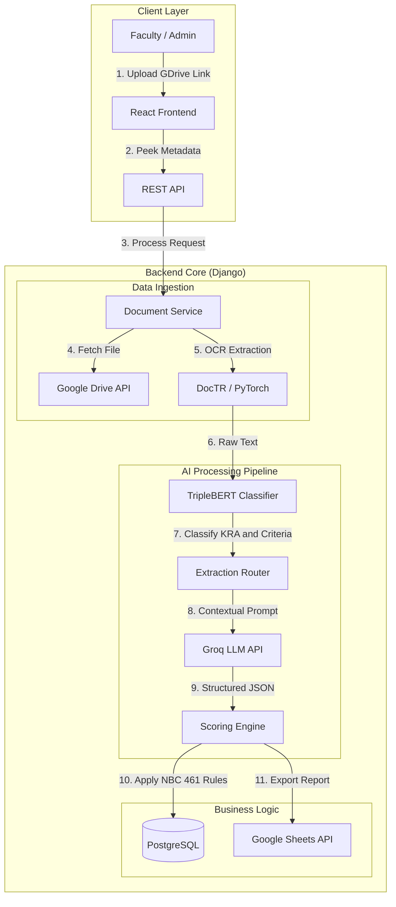

<div align="center">

# 🎓 DocEval Kapiyu
### Intelligent Faculty Evaluation & Promotion System (NBC 461)

[](https://reactjs.org/)
[](https://www.djangoproject.com/)
[](https://pytorch.org/)
[](https://groq.com/)
[](https://developers.google.com/drive)

<p align="center">
  <b>Automating Academic Advancement with Hybrid AI Architecture</b><br>
  <i>Streamlining the NBC 461 evaluation process for State Universities and Colleges.</i>
</p>

</div>

---

## 📖 Overview

**DocEval Kapiyu** is a sophisticated web application engineered to modernize the faculty evaluation and promotion lifecycle. It employs a **Hybrid AI Architecture** combining a fine-tuned **BERT (Bidirectional Encoder Representations from Transformers)** model for high-speed document classification and **Groq LLM** for precise information extraction.

This system automates the end-to-end process: from fetching documents via Google Drive to calculating **NBC 461** points and generating gap analysis reports.

---

## 🏗️ System Architecture

The system follows a modular microservices-like architecture within a monolithic Django backend, separating concerns between data ingestion, AI processing, and business logic.



### 🧠 The AI Pipeline Explained

1.  **Ingestion & OCR:** Documents (PDF/Images) are fetched from Google Drive and processed using **DocTR (Deep Learning OCR)** to extract raw text with high fidelity.
2.  **Classification (BERT):** The raw text is passed to a custom **TripleBERTClassifier** (PyTorch). This hierarchical model simultaneously predicts:
    *   **KRA:** Key Result Area (e.g., Instruction, Research).
    *   **Criterion:** Specific category (e.g., Advisership, Publication).
    *   **Sub-criterion:** Granular detail (e.g., International, National).
3.  **Extraction (Groq LLM):** Once classified, the system selects a specialized prompt strategy. It sends the text to **Groq** (Llama 3 / Mixtral) to extract specific entities like *Academic Year*, *Degree Program*, *Role*, and *Publication Title*.
4.  **Scoring (NBC 461):** The extracted data is validated against strict NBC 461 rules (e.g., mapping "BSIT" to "Special Project") to calculate the final CCE points.

---

## ✨ Key Features

| Feature | Description |
| :--- | :--- |
| **⚡ Hybrid AI Engine** | Uses **BERT** for fast, local classification and **Groq** for intelligent, context-aware data extraction. |
| **👀 Smart "Peek" Preview** | Instantly validates Google Drive links and previews folder/file names before submission to prevent errors. |
| **📊 Automated Scoring** | Calculates **CCE (Common Criteria for Evaluation)** points automatically based on strict NBC 461 rules. |
| **☁️ Cloud Integration** | Seamlessly fetches documents from **Google Drive** and exports detailed evaluation reports to **Google Sheets**. |
| **📈 Gap Analysis** | Visualizes the gap between a faculty's current points and the next rank requirements. |
| **🔒 Secure Auth** | Role-based access control (Faculty vs. Admin) with email verification and secure session management. |

---

## 🛠️ Tech Stack

<details>
<summary><b>Frontend (Client Side)</b></summary>

*   **Framework:** React.js 18
*   **Styling:** Bootstrap 5, Custom CSS, Framer Motion (Animations)
*   **State Management:** Context API
*   **HTTP Client:** Axios
</details>

<details>
<summary><b>Backend (Server Side)</b></summary>

*   **Framework:** Django REST Framework (DRF)
*   **Deep Learning:** PyTorch, Transformers (Hugging Face)
*   **Model:** Custom `TripleBERTClassifier` (bert-base-uncased)
*   **LLM Integration:** Groq API
*   **OCR:** DocTR (Document Text Recognition)
*   **Database:** PostgreSQL
</details>

<details>
<summary><b>Integrations & Tools</b></summary>

*   **Google Cloud Platform:** Drive API v3, Sheets API v4
*   **Containerization:** Docker & Docker Compose
*   **Authentication:** JWT / Token-based Auth
</details>

---

## 🚀 Getting Started

### Prerequisites
*   Node.js & npm
*   Python 3.10+
*   Google Cloud Service Account (`credentials.json`)
*   Groq API Key
*   PyTorch & Transformers

### 1. Clone the Repository
```bash
git clone https://github.com/yourusername/DocEvalKapiyu.git
cd DocEvalKapiyu
```

### 2. Backend Setup
```bash
cd backend
python -m venv venv
# Windows
.\venv\Scripts\activate
# Linux/Mac
source venv/bin/activate

pip install -r requirements.txt
python manage.py migrate
python manage.py runserver
```

### 3. Frontend Setup
```bash
cd frontend
npm install
npm start
```

### 4. One-Command Startup (Windows)
From the project root, run:

```bat
start-all.bat
```

This starts both:
*   Django backend (`http://localhost:8000`)
*   React frontend (`http://localhost:3000`)

It runs in a single Command Prompt window.

It also automatically creates/updates `THESIS_2026 Start.lnk` on your Desktop and opens `http://localhost:3000` in your browser.

---

## ⚙️ Configuration

Create a `.env` file in the `backend` directory:

```env
# Django Settings
SECRET_KEY=your_secret_key
DEBUG=True

# Database
DB_NAME=doceval_db
DB_USER=postgres
DB_PASSWORD=password
DB_HOST=localhost

# API Keys
GROQ_API_KEY=gsk_...
GOOGLE_SERVICE_ACCOUNT_FILE=credentials.json

# Email
EMAIL_HOST_USER=your_email@gmail.com
EMAIL_HOST_PASSWORD=your_app_password
```

---

## 👥 Authors

*   **Rolan Sotomayor** - *Lead Developer*

---

<div align="center">
  <sub>Built with ❤️ for Academic Excellence</sub>
</div>
